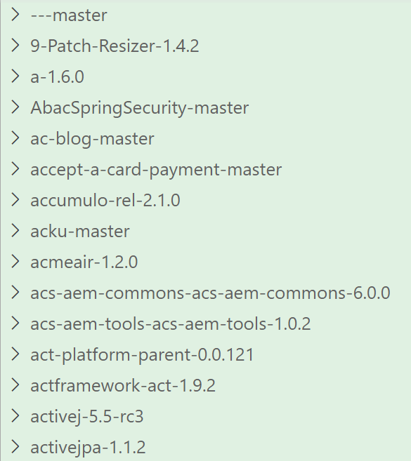
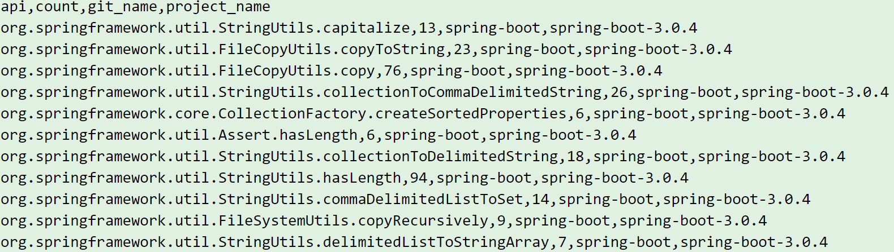
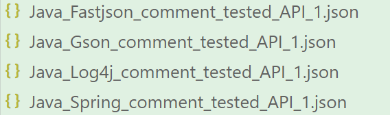
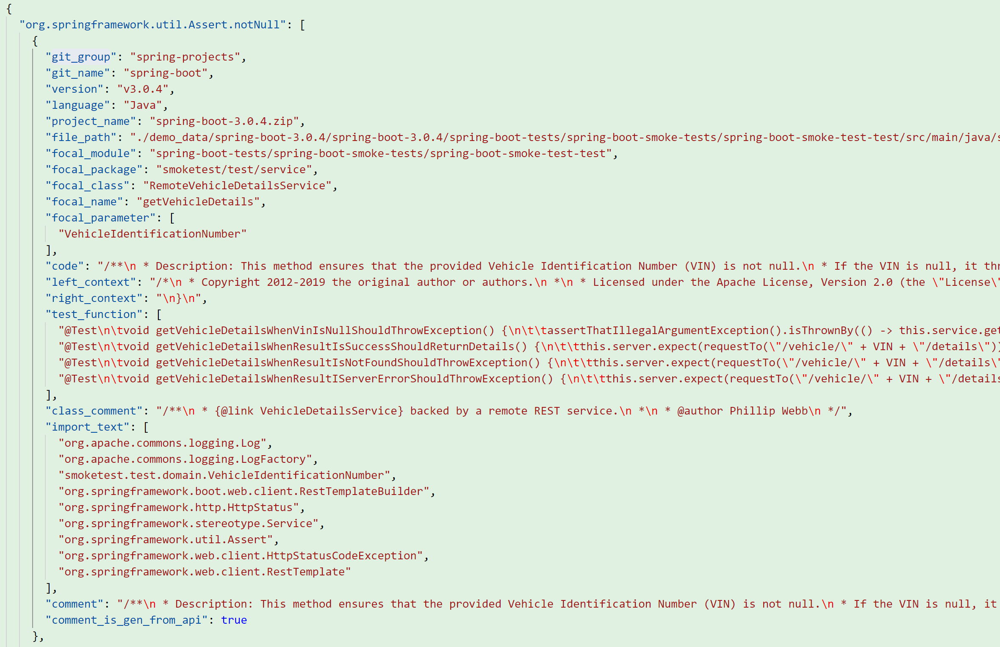

**其他语言版本: [English](README.md), [中文](README_zh.md).**

## 项目简介

本项目旨在爬取GitHub的高星项目，并解析项目依赖信息，判断其是否依赖于`/setup/profile.yaml`中指定的API，从而构建远程项目依赖表，再从依赖表中获取项目相关信息，并解析项目，生成最终数据集。用户也可自行提供项目依赖表（XLS 或者 XLSX 文件）用户提供的表格应包含如下字段：`git_group`、`git_name`、`language`、`version`、`download_url`、`file_name`、`update_time` 和 `create_time`。一个示例的远程仓库信息表可见[analysis_repo_dependency/analysis_repo_dependency1.xls](analysis_repo_dependency/analysis_repo_dependency1.xls)。

### Java 数据集字段

- `git_group`: 存放项目的 Git 组织或组织。
- `git_name`: Git 上项目的名称。
- `version`: 项目的版本号。
- `language`: 项目使用的编程语言。
- `project_name`: 项目的名称。
- `create_time`: 项目创建时间。
- `update_time`: 项目最后更新时间。
- `file_path`: 源代码仓库中相关焦点类的文件路径。
- `focal_module`: 项目的焦点模块。
- `focal_package`: 项目的焦点包。
- `focal_class`: 项目的焦点类。
- `focal_name`: 项目的焦点方法名称。
- `focal_parameter`: 项目的焦点方法参数列表。
- `solution`: 相关问题的解决方案。注意，这直接来自原始源文件。根据下游任务的类型（代码补全或代码生成）和需要向模型提供的上下文量，用户可以采用和更新提示字段。
- `method_signature`: 目标焦点方法的方法签名。
- `left_context`: 焦点方法之前的源代码。
- `right_context`: 焦点方法之后的源代码（括号结束后）。
- `test_function`: 从原始源代码中提取的测试函数列表，对应于测试焦点方法。
- `class_comment`: 焦点类的类注释。
- `import_text`: 导入包的列表。
- `prompt`: 可直接用于执行代码生成的提示消息。请注意，如果原始源代码没有代码注释，我们将使用 DeepSeekCoder 生成注释。我们用于生成代码注释的提示是：“总结以下使用 [框架] 的代码，并生成 [编程语言] 注释。响应应由两部分组成:描述以及块标签。块标签应包括 @param 和 @return。”
- `prompt_is_gen_from_api`: true = 提示消息由 DeepSeekCoder API 生成；false = 提示消息是代码存储库中的原始代码注释。

### Python 数据集字段

- `git_group`: 存放项目的 Git 组织或组织。
- `git_name`: Git 上项目的名称。
- `version`: 项目的版本号。
- `language`: 项目使用的编程语言。
- `project_name`: 项目的名称。
- `create_time`: 项目创建时间。
- `update_time`: 项目最后更新时间。
- `file_path`: 源代码仓库中相关焦点类的文件路径。
- `file_name`: 文件名称。
- `focal_class`: 项目的焦点类。
- `focal_name`: 项目的焦点函数名称。
- `focal_parameter`: 项目的焦点函数参数列表。
- `solution`: 相关问题的解决方案。注意，这直接来自原始源文件。根据下游任务的类型（代码补全或代码生成）和需要向模型提供的上下文量，用户可以采用和更新提示字段。
- `function_signature`: 目标焦点函数的函数签名。
- `left_context`: 焦点函数之前的源代码。
- `right_context`: 焦点函数之后的源代码（括号结束后）。
- `test_function`: 从原始源代码中提取的测试函数列表，对应于测试焦点方法。
- `import_text`: 导入文本的列表。
- `prompt`: 可直接用于执行代码生成的提示消息。请注意，如果原始源代码没有代码注释，我们将使用 DeepSeekCoder 生成注释。我们用于生成代码注释的提示是：“总结以下使用 [框架] 的代码，并生成 [编程语言] 注释。响应应由两部分组成：描述以及块标签。块标签应包括 @param 和 @return。”
- `prompt_is_gen_from_api`: true = 提示消息由 DeepSeekCoder API 生成；false = 提示消息是代码存储库中的原始代码注释。


### 功能特点

- 爬取GitHub高星项目，并分析其依赖情况
- 从远程仓库信息表中获取项目信息，并下载项目。
- 解析项目，分析出其中的 API 调用情况。
- 根据对应框架的 API 调用频率，再次解析项目，提取出对应api的包含测试函数的数据集。
- 支持 Python 和 Java 项目的解析。

### 如何使用

运行工具
```sh
python3 -m dataset_extract
```

### 输出示例

一个默认的输出示例：
- 会在当前目录下生成三个文件夹`./csv_files`、`./json_files`、`./repositories`。
- `./repositories`存放了远程仓库信息表中的所有项目，类似于下图：  

- `./csv_files`存放了在远程仓库信息表中的所有项目的api调用情况，其中会为[setup/profile.yaml](setup/profile.yaml)中提供的所有需要提取的API分别创建一个`{language}_{API}_repo_acount.csv`和`{language}_{API}_repo_acount_analysis.csv`类似于下图：  

  - `{language}_{API}_repo_acount.csv`的示例图如下：  
  
  - `{language}_{API}_repo_acount_analysis.csv`的示例图如下：  
  
- `./json_files`存放了最终数据集，其中会为[setup/profile.yaml](setup/profile.yaml)中提供的所有需要提取的API分别创建一个`{language}_{api}_comment_tested_API_1.json`，类似于下图：  

  - `{language}_{api}_comment_tested_API_1.json`的示例图如下：  
  

### 配置文件
可自行更改配置文件[setup/profile.yaml](setup/profile.yaml)。

### 注意事项

- 项目将会下载远程仓库中的文件，请确保提供的下载链接是可访问的。
- 下载的项目文件需要符合`utf-8`的格式，以便项目能够正确解析。
- 工具只能在项目的当前目录下运行，其他目录下运行会报路径错误。
